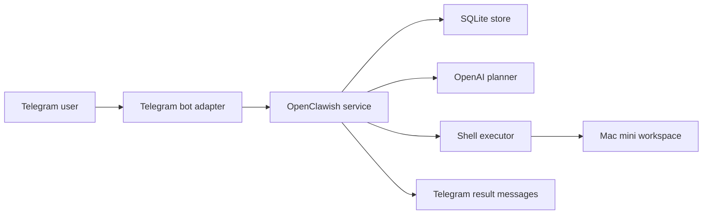

# Architecture

## Goal

Build a local agent system that feels close to OpenClaw operationally:

- remote command ingress
- persistent task state
- tool execution on a resident machine
- optional model-driven planning
- visible audit trail
- safety boundaries around dangerous actions

## High-level design

## Components

### `telegram_bot`

Receives commands from Telegram long polling, authenticates chat IDs, and forwards each request into the application service.

### `service`

The orchestration layer. It:

- creates tasks
- determines whether the request is direct shell or natural-language goal
- records lifecycle events
- calls the planner if needed
- sends the work to the executor
- formats a compact Telegram-safe result

### `planner`

The OpenAI integration. The current planner:

- receives a natural-language goal and policy context
- asks either the local `codex` CLI or an OpenAI model for a bounded shell plan
- returns a structured plan
- falls back cleanly if the API is unavailable

### `executor`

Runs shell commands with:

- configurable workspace root
- timeout enforcement
- allow/deny command matching
- stdout/stderr capture
- shared starting directory for both execution modes

### `store`

SQLite persistence for:

- tasks
- task events
- command runs

## Execution model

There are two task modes:

1. Direct mode
   `/run git status`
   The command is checked against policy and executed immediately.

2. Goal mode
   `/goal audit the repo and list missing tests`
   The planner produces a short list of commands, then each command is policy-checked and executed.

The service also has two execution scopes:

- `workspace`
  Blocks absolute-path access outside the configured workspace and rejects parent traversal.
- `system`
  Allows broader host-level shell access while still starting in the configured workspace directory.

## Safety boundaries

The MVP has a conservative bias:

- only approved Telegram chat IDs may issue commands
- execution stays inside a configured workspace directory
- denylist blocks destructive commands by default
- each command is logged before and after execution
- command count and output size are bounded

## Extension path toward deeper OpenClaw parity

To move closer to a fuller OpenClaw-style platform, add:

- desktop automation on top of `computer-use-preview`
- screenshot loop and UI state grounding
- browser automation layer
- multiple tool classes beyond shell
- approval queues with inline action buttons
- remote web console
- artifact upload and download support
