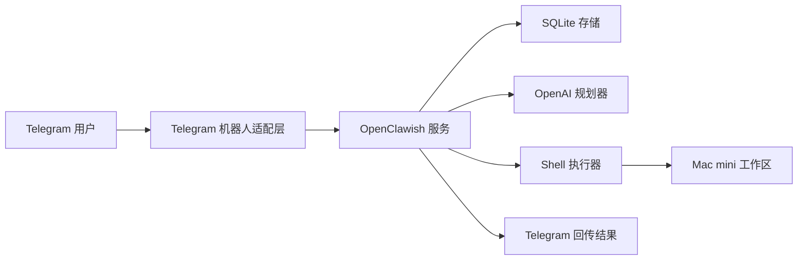

# 系统架构

## 目标

构建一套在运行方式上接近 OpenClaw 的本地 Agent 系统，核心能力包括：

- 远程命令入口
- 持久化任务状态
- 常驻机器上的工具执行
- 可选的模型规划
- 可审计的执行记录
- 围绕危险操作的安全边界

## 高层设计

## 组件说明

### `telegram_bot`

负责接收 Telegram long polling 消息、校验 chat ID 是否授权，并把请求转发给应用服务。

### `service`

它是编排核心，负责：

- 创建任务
- 判断请求属于直接命令还是自然语言目标
- 记录任务生命周期事件
- 在需要时调用规划器
- 将执行工作发送到执行器
- 组装适合 Telegram 返回的简洁结果

### `planner`

模型规划层，当前职责包括：

- 接收自然语言目标和执行约束
- 让本机 `codex` CLI 或 OpenAI 模型输出一个有边界的 shell 计划
- 返回结构化计划结果
- 在 API 不可用时平滑降级

### `executor`

负责实际运行 shell 命令，并提供：

- 可配置的工作目录
- 超时控制
- 命令允许/拒绝策略匹配
- stdout / stderr 捕获
- 为两种执行模式提供统一的默认起始目录

### `store`

通过 SQLite 保存：

- 任务
- 任务事件
- 命令执行记录

## 执行模型

系统支持两种主要任务模式：

1. 直接执行模式
   `/run git status`
   命令通过策略检查后立即执行。

2. 目标规划模式
   `/goal 审查仓库并列出缺失测试`
   规划器先生成一组短命令，再逐条经过策略检查并执行。

除此之外，服务还支持两种执行范围：

- `workspace`
  阻止访问工作区外的绝对路径，并拒绝父目录穿越。
- `system`
  允许更大范围的主机级 shell 访问，但仍从配置的工作区目录启动命令。

## 安全边界

当前 MVP 采取偏保守的策略：

- 只有被允许的 Telegram chat ID 才能发起命令
- 执行限制在配置好的工作目录内
- 默认 denylist 会阻止破坏性命令
- 每条命令执行前后都会写入日志
- 限制单个任务的命令数量和输出大小

## 向更完整 OpenClaw 形态演进

如果要进一步接近完整 OpenClaw 风格平台，可以继续增加：

- 基于 `computer-use-preview` 的桌面自动化
- 截图循环与 UI 状态感知
- 浏览器自动化层
- 除 shell 之外的更多工具类型
- 带 Telegram inline button 的审批队列
- 远程 Web 控制台
- 产物上传与下载能力
